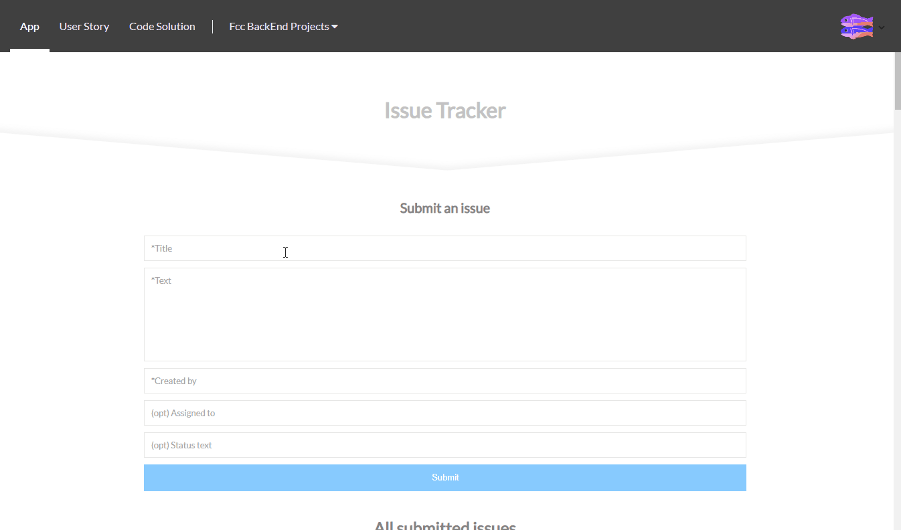

# Issue Tracker
### About the project

it's a freecodecamp project in the "Information Security and Quality Assurance Projects" module, you have to build a back-end that will receive a measuring unit and return a json response containing the converted unit.

bonus*: 
- Front-end using React

### Tools used

**Front-end:** React

**Back-end:** Express, Joi, Helmet

**Test:** Mocha, Chai

### Screenshot

### Link

https://fcc-bt-issue-tracker.glitch.me

### User stories

1. Prevent cross site scripting(XSS attack).
2. I can POST `/api/issues/{projectname}` with form data containing required `issue_title`, `issue_text`, `created_by`, and optional `assigned_to` and `status_text`.
3. The object saved (and returned) will include all of those fields (blank for optional no input) and also include `created_on`(date/time), `updated_on`(date/time), `open`(boolean, true for open, false for closed), and `_id`.
4. I can PUT `/api/issues/{projectname}` with a `_id` and any fields in the object with a value to object said object. Returned will be 'successfully updated' or 'could not update '+_id. This should always update `updated_on`. If no fields are sent return 'no updated field sent'.
5. I can DELETE `/api/issues/{projectname}` with a `_id` to completely delete an issue. If no `_id` is sent return '_id error', success: 'deleted '+_id, failed: 'could not delete '+_id.
6. I can GET `/api/issues/{projectname}` for an array of all issues on that specific project with all the information for each issue as was returned when posted.
7. I can filter my get request by also passing along any field and value in the query(ie. `/api/issues/{project}?open=false`). I can pass along as many fields/values as I want.
8. All 11 functional tests are complete and passing.